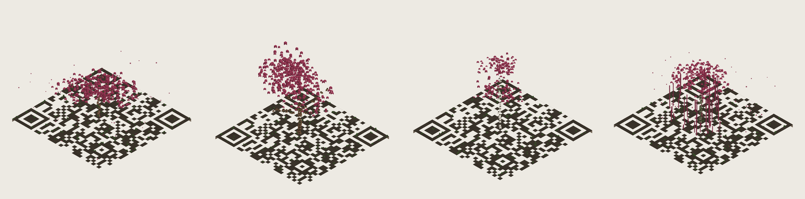
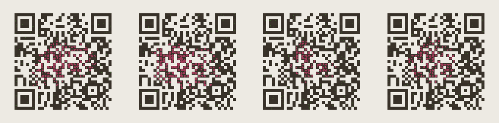
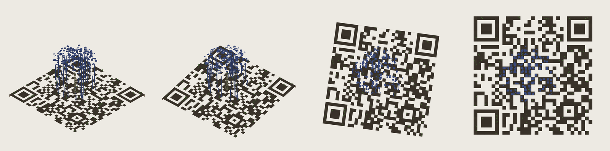
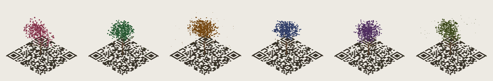

# QR Arboretum

Type a URL. It grows into an isometric voxel tree on a square plot. Tap the
plot and the camera swings to straight-down, where the whole diorama reads as a
scannable QR code.

Two builds, same behaviour:

| file | renderer | size | dependencies |
|---|---|---|---|
| `index.html` | canvas 2D, painter's algorithm | 70 KB | none |
| `three.html` | WebGL, three.js r180 vendored inline | 762 KB | none at runtime |

Both are single files and both run from a `file://` URL with no network access.
Open either one directly in a browser.



Spring sakura, summer oak, autumn gum, winter willow. Tap the plot and each one
flattens into its own code:





---

## The trick

Generate the QR matrix first, then plant the scene so that **every voxel above
ground sits on a dark module** — trunk, branches, leaves, grass, all of it.
The straight-down view then reproduces the matrix exactly, whatever shape the
planting takes. Light modules are pale paving; dark modules are dark soil with
things growing out of them.

The rule is cheap to enforce because **darkness is a property of `(x, y)`
only** — it does not vary with height. Two consequences shape everything:

- A vertical column planted on a dark cell is dark at every level. Trunks and
  willow tendrils are never eroded.
- Anything that spreads in x/y — crowns, limbs, foliage — gets carved by the
  matrix. **That carving is the look.**

The ground layer alone already reproduces the matrix. Foliage only ever adds
more dark on top of already-dark cells, so it cannot damage the code.

## Constraints worth keeping

**Cubes may be smaller than their module and offset inside it, but must never
cross the edge.** This is what makes foliage look organic instead of like
stacked crates. Leaves are roughly half-module scale, scattered, several per
column at varied heights. Enforced in exactly one place — `place()` in
`src/scene.js`, the only function that creates a voxel.

**Gaps in foliage are safe, and are the strongest part of the code.** Soil
under a dark module scores 10.2:1 against the paving; the foliage itself
scores about 5:1. There is deliberately no rule that foliage must fill its
module — it would buy nothing and it is exactly what makes crowns look blocky.

**Every colour that can land on a dark module needs ≥3:1 contrast against the
paving.** See below; this forces deeper tones than anyone would pick for looks.

**Tonal variation on dark-module surfaces only ever goes darker; variation on
paving only ever goes lighter.** If the two families converge you get an
unscannable code that looks fine on screen.

**Side faces are never seen from overhead**, so they can carry colour the code
could not survive on top. The gum's near-white bark is 1.11:1 against the
paving — unusable on a top face, fine on a side.

**Wind decays to exactly zero in the code view.** Horizontal sway moves leaves
off their modules and destroys the code. Amplitude is scaled by `(1 - t)²`, and
each voxel is *sheared* between its base and its top rather than translated, so
trees bend instead of sliding. Displacement grows as `height^1.4` with a
per-voxel phase hashed from position.

**A 4-module quiet zone** is reserved as the camera goes overhead, and the
canvas background is flooded with the paving colour so the margin reads light.

### Draw order (canvas build only)

The full-plot slab cannot be depth-sorted against the tiles sitting on it — one
centre-point key gets it wrong and it paints over the back half of the ground.
It is drawn first, outside the sort.

Watch the origin convention: `render.js` gives every box by its **minimum
corner plus extents**, with no implicit half-module shift anywhere. The slab is
therefore exactly `(0,0)` to `(n,n)`. If a `-0.5` shift is ever added to the
drawing code, the slab's own x/y must cancel it or it juts past two edges and
eats the quiet zone.

Flat ground never overlaps anything standing on it, so it is painted wholesale
before the sort — which lets it be cached to an offscreen canvas between
frames. That cache matters, because wind forces a full redraw every frame.

**All three of those constraints are artefacts of painter's-algorithm sorting
and simply evaporate in `three.html`**, where a depth buffer does the work.
What does *not* evaporate is everything above: the contrast floor, the
edge-crossing rule, and the wind decay all survive unchanged.

---

## Where the contrast floor overrode taste

Paving is `#EDEAE3` (luminance 0.824). At a 3:1 floor, anything that can land
on a dark module must sit at luminance ≤ 0.241. That is much darker than these
colours want to be. Every swatch below is the deep version; the "natural
choice" column is what a designer would actually reach for, and what it scores:

| swatch | shipped | ratio | natural choice | ratio |
|---|---|---|---|---|
| Rose | `#9E3B58` | 5.4:1 | `#F8C8DC` | **1.2:1** |
| Jade | `#2F6B3C` | 5.3:1 | `#7BC47F` | **1.7:1** |
| Amber | `#8A5312` | 5.3:1 | `#F2B441` | **1.5:1** |
| Indigo | `#3A4A7C` | 7.1:1 | `#8FA8DE` | **2.0:1** |
| Plum | `#5D3570` | 7.9:1 | `#C79BE0` | **1.9:1** |
| Moss | `#4A5A22` | 6.3:1 | `#AFC46B` | **1.6:1** |



Pastel pink is 1.2:1 and will not scan. The sakura is a deep rose because
arithmetic says so, not because anyone preferred it.

One second-order consequence is worth calling out, because it looks like a
style choice and is not. With every top face forced dark, shading the side
faces *lighter* — the obvious move — makes every leaf read as a dark cap on a
pale stalk, and the crown looks like a field of mushrooms. Side faces are
exempt from the floor, so they are shaded **darker** than the tops instead,
which restores ordinary top-lit form for free. The gum keeps light sides,
because its pale bark is the entire point of the species.

---

## The QR encoder

Written from scratch: byte mode, versions 1–20, ECC L/M/Q/H. `src/qr.js`, no
dependencies, runs in the browser and under Node.

Two traps that cost real time:

**The Reed–Solomon generator polynomial is easy to build with its coefficients
reversed.** It is symmetric at degree 1 — the answer is the single element
`[1]` either way — so it looks correct until degree 2, where the right answer
is `[3, 2]` and the reversed one is `[2, 3]`. `rsGeneratorSelfTest()` pins that
case down and the harness asserts it.

**Penalty rule 3** (the 1:1:3:1:1 finder lookalike) must scan
**non-overlapping**, and must treat modules outside the symbol as **light**.
Both halves matter. Drop the virtual border and edge-hugging lookalikes go
unpenalised; let the scan window overlap and one dark core gets scored
repeatedly. Either way mask selection drifts toward codes real scanners
struggle with.

### Cross-check against segno

```
Reed-Solomon generator polynomial
  degree 1 -> [1]        (symmetric: reversal is invisible here)
  degree 2 -> [3, 2]     (must be [3, 2]; reversed would be [2, 3])
  degree 7 -> [127, 122, 154, 164, 11, 68, 117]
  OK - not reversed

Forced-mask comparison (encoder correctness, segno padding emulated)
  identical to segno : 592
  genuine mismatches : 0
  versions exercised : 1..17

Free-mask comparison (mask selection)
  same mask as segno : 74/74 (100%)  -- differences are legal
```

Two notes on the comparison:

**segno's padding quirk is systematic, not occasional.** `write_padding_bits()`
computes `8 - (length % 8)`, which yields 8 — a whole spurious zero byte — when
the stream is already byte-aligned. In byte mode the stream is
`4 + count + 8n` bits, which after a full 4-bit terminator is *always*
aligned, so segno inserts that byte on **every** byte-mode symbol. The
comparison runs with an opt-in `padQuirk` flag that reproduces it, which
isolates the difference to exactly that byte and proves everything else — bit
stream, RS codewords, interleaving, module placement, masking, format and
version info — is identical.

**Non-ASCII needs `encoding="utf-8"` on the segno side.** segno defaults byte
mode to ISO-8859-1 when the text fits; we always emit UTF-8.

Masks may also differ legitimately, since segno scores before writing format
info. In practice they agreed on all 74 cases here.

---

## Verification

```
python build.py                                   # produce index.html + three.html
python test/test_qr_vs_segno.py                   # encoder vs segno
python test/test_qr_decode.py                     # shipped matrices, ZBar
python test/test_render.py                        # canvas 2D, full sweep
python test/test_render.py --target three.html    # WebGL, full sweep
python test/shoot.py                              # preview sheets into out/
```

**Do not trust `cv2.QRCodeDetector`** (the legacy OpenCV one). It fails on
perfectly valid codes and will send you chasing bugs that do not exist. The
gate here is **pyzbar** (ZBar, the engine behind many real scanner apps), with
`cv2.QRCodeDetectorAruco` as a second opinion.

The harness rasterises the **actual render** through a real headless browser
and decodes those pixels. It does not check module colours analytically — that
version cannot see the slab, antialiasing, the half-pixel tile inflation, or a
voxel overhanging its module, and it would pass while the real thing fails.

### Results

`index.html`, 6 links × 4 seasons × 6 swatches:

```
combinations swept   : 144
geometry checks      : 288 (no malformed faces)

1. ZBar, clean       : 144/144 (100.0%)
   cv2 Aruco         : 144/144 (100.0%)   [second opinion]
2. matrix from pixels: 144/144 (100.0%) exact, 0 modules differ
   quiet zone min lum: 234/255 (paving ~234; must stay light)
3. through camera    : 432/432 (100.0%)  (warp+blur+dim+noise+downscale)
4. wind at t=1       : bit-identical across 3 clocks
   wind at t=0       : moving
```

The checks are:

1. **Decode clean.** ZBar on the code-view render.
2. **Matrix from pixels.** Reconstruct the matrix by sampling rendered pixels
   and diff it against the true matrix. Must differ by zero modules.
3. **Camera simulation.** Perspective warp, roll, defocus, dim uneven light,
   sensor noise, downscale to ~40%.
4. **Wind.** Bit-identical at `t=1` across different clock times, and genuinely
   moving at `t=0`.
5. **Geometry sweep.** Every link × season × swatch, at both ends of the flip,
   checked for non-finite coordinates, zero-area faces, zero-extent voxels,
   voxels crossing a module edge, voxels on a light module, and missing faces.

### Bugs this found

- **Block interleave was missing the short-block placeholder.** Short blocks
  must be stored at the long-block length with a placeholder in their last data
  slot. Without it the ECC section starts one index early and the interleave
  skip lands on a real error-correction codeword — the entire ECC run comes out
  shifted by one and the symbol is quietly corrupt.
- **The WebGL build rendered the whole plot mirrored left-to-right.**
  `render.js` projects with x right, y *down* and z toward the viewer, which is
  a left-handed frame; three.js is right-handed. **ZBar decodes mirrored QR
  codes perfectly happily**, so this passed the decode gate at 24/24 and was
  caught only by the pixel-level matrix diff, which reported 468 differing
  modules and `fliplr == True`. Fixed by negating Y when writing vertices and
  building the camera basis in that space.

---

## Layout

```
src/qr.js            QR encoder, no dependencies
src/palette.js       colour + the contrast floor
src/scene.js         four planting routines
src/render.js        canvas 2D axonometric renderer
src/app.js           canvas build UI
src/three-app.js     WebGL build (reuses qr/palette/scene untouched)
build.py             inlines everything into index.html / three.html
test/                verification harness
vendor/              three.js, bundled to a single global with esbuild
```

`src/` exists so the modules can be unit-tested under Node; the shipped
artefacts are the two HTML files, and `build.py` asserts no external reference
survives into either.

## Licence

MIT. Bundled three.js is MIT, © three.js authors.
