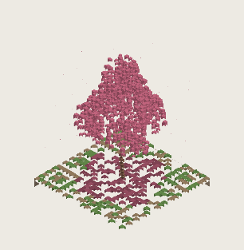
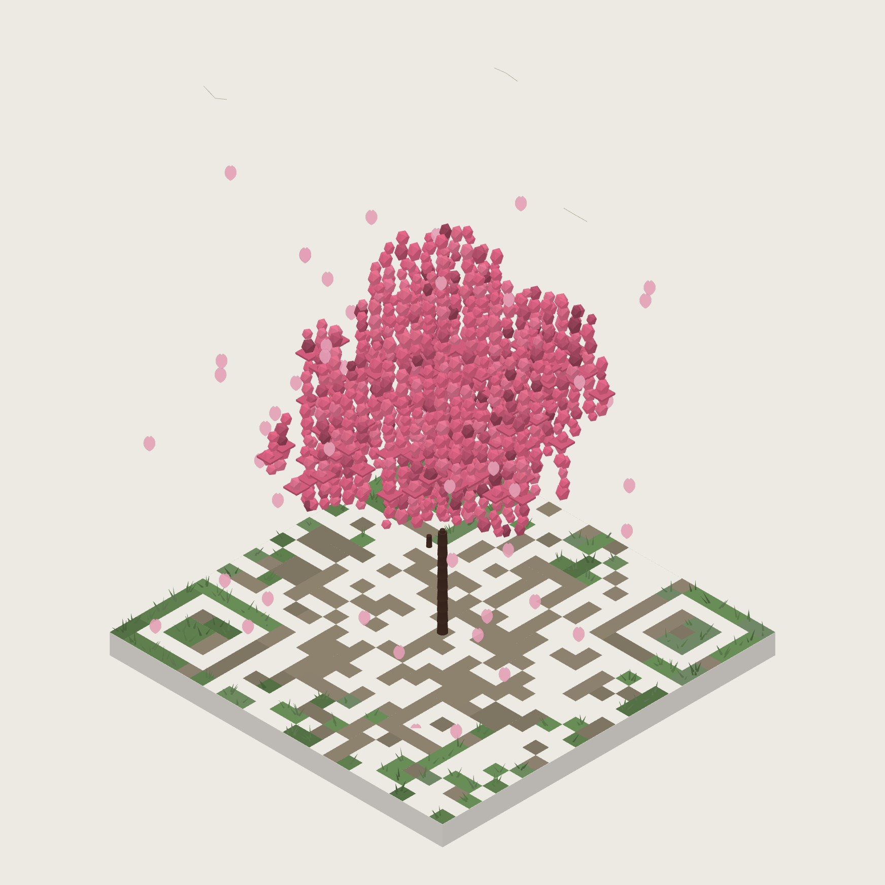

# QR Arboretum

Type a URL. It grows into an isometric voxel tree on a square plot. Tap the
plot and the camera swings to straight-down, where the whole diorama reads as a
scannable QR code.

Two builds, same behaviour, same test suite:

| file | renderer | size | frame cost | dependencies |
|---|---|---|---|---|
| **`index.html`** | WebGL, three.js r180 vendored inline, InstancedMesh | 765 KB | 0.8 ms | none at runtime |
| `canvas.html` | canvas 2D, painter's algorithm | 73 KB | 58 ms | none at all |

Both are single files and both run from a `file://` URL with no network access.
Open either directly in a browser. (Median frame cost on the heaviest scene —
5,226 voxels at 37x37 — after a warm-up in a fresh page. The WebGL figure is
software-rendered SwiftShader, so a real GPU is faster still.)

The canvas figure has a long tail: nine runs of the same scene gave 33, 58 and
1480 ms at min, median and max. That is garbage collection, not fill rate.
`collectFaces` allocates a fresh object and array per face — about 15,700 of
each per frame at that scene — and the crowns are now large enough for it to
matter. Thinning the lower shell (`SHELL_LOWER`) is the cheap lever, and is
already at 0.45; the real fix is pooling those objects across frames. WebGL is
unaffected because it writes into pre-allocated instance buffers.


Spring sakura, summer oak, autumn ginkgo, winter willow. Tap the plot and each one
flattens into its own code:




The flip in motion — wind and petals at rest, decaying to exactly zero as the
camera swings overhead. Also as video: [`docs/flip.mp4`](docs/flip.mp4)
(one tree) and [`docs/seasons.mp4`](docs/seasons.mp4) (all four).

A single tree at full size — `https://smaran.studio`, silhouette aspect 1.021:



---

## The trick

Generate the QR matrix first, then plant the scene so that **every voxel above
ground sits on a dark module** — trunk, branches, leaves, grass, all of it.
The straight-down view then reproduces the matrix exactly, whatever shape the
planting takes. Light modules are pale paving; dark modules are dark soil with
things growing out of them.

The rule is cheap to enforce because **darkness is a property of `(x, y)`
only** — it does not vary with height. Two consequences shape everything:

- A vertical column planted on a dark cell is dark at every level. Trunks and
  willow tendrils are never eroded.
- Anything that spreads in x/y — crowns, limbs, foliage — gets carved by the
  matrix. **That carving is the look.**

The ground layer alone already reproduces the matrix. Foliage only ever adds
more dark on top of already-dark cells, so it cannot damage the code.

## Constraints worth keeping

**Cubes may be smaller than their module and offset inside it, but must never
cross the edge.** This is what makes foliage look organic instead of like
stacked crates. Leaves are roughly half-module scale, scattered, several per
column at varied heights. Enforced in exactly one place — `place()` in
`src/scene.js`, the only function that creates a voxel.

**Gaps in foliage are safe.** There is deliberately no rule that foliage must
fill its module — it would turn every crown into a stack of crates. What the
gaps must not show is *bare brown ground*; see the fallen-blossom carpet
below.

But the carving is not what made the canopy read as lace. See below.

**Every dark module is a raised block, never a flat tile.** Flat tiles make
the plot read as ink printed on a floor. Raised blocks make it read as terrain
the tree is growing out of. Grass and soil where the crown does not reach,
fallen blossom where it does.

Height matters more than it sounds. At around a quarter of a module the blocks
still read as flat plates scattered on the slab — the exact failure raising
them was meant to fix. They are 0.52–0.82 of a module, which is enough side
face to register as depth from the isometric view and changes nothing overhead.

**Ground sits near 3.5:1, not the near-black 10:1 you first reach for.** The
ground layer alone reproduces the matrix, so the instinct is to make it as
dark as possible — but the floor is 2.45:1 and every stop past it is headroom
spent on nothing, at the cost of a floor that competes with the tree.

**A dark module's area-weighted MEAN needs ≥2.45:1 against the paving — not
every individual face.** A scanner thresholds a module; it never sees a voxel. See
below: getting this wrong is what made the canopy read as stacked bricks.

**Tonal variation on dark-module surfaces only ever goes darker; variation on
paving only ever goes lighter.** If the two families converge you get an
unscannable code that looks fine on screen.

**Side faces are never seen from overhead**, so they can carry colour the code
could not survive on top. The ginkgo's near-white bark is 1.11:1 against the
paving — unusable on a top face, fine on a side.

**Wind decays to exactly zero in the code view.** Horizontal sway moves leaves
off their modules and destroys the code. Amplitude is scaled by `(1 - t)²`, and
each voxel is *sheared* between its base and its top rather than translated, so
trees bend instead of sliding.

Three details that are easy to get wrong, and were:

- **Phase is per COLUMN, not per voxel.** Hashing `z` into it gave every voxel
  in a stack its own phase, so a trunk's nine bark segments displaced
  independently and the trunk *split at its seams* — two abutting segments at
  +0.193 and −0.018 in the same instant, a 0.21-module tear. It also made the
  canopy boil rather than sway. Phase per column means a column moves as one
  piece and neighbours lag into a wave.
- **Height is normalised by `maxZ`.** Using absolute `z` made displacement grow
  with the tree, so a bigger code got a windier tree: 2.22 modules of crown
  sway at n=25 rising to 3.26 at n=33. As a fraction of tree height it is
  scale-free — 0.500 modules at both.
- **Stiffness is per kind.** Bark and leaf obeying one law made trunks sway
  like saplings. `bark 0.15, leaf 1.0, blade 0.4, ground 0` — the trunk now
  moves 0.009 modules and the ground exactly zero.

The law lives in `scene.js` as a precomputed per-voxel coefficient, so both
renderers obey it instead of each reimplementing `pow(z, 1.4)`.

**A 4-module quiet zone** is reserved as the camera goes overhead, and the
canvas background is flooded with the paving colour so the margin reads light.

In the WebGL build that margin *is* the renderer's clear colour, which means it
has to survive a lost GPU context — and it did not. three.js rebuilds its
background module inside `initGLContext()`, which it re-runs on
`webglcontextrestored`, and the fresh module starts at **black**. Nothing
re-applied ours, so after any context loss the quiet zone came back black: the
one region a scanner needs light. The app now re-applies the clear colour on
that event.

The sweep could not catch it. It launches ANGLE + SwiftShader, which never drops
the context; raw `--use-gl=swiftshader` loses it on every startup. It was found
by *opening the page*, not by testing it — which is the argument for driving the
real UI even when 288 automated checks are green. There is now a check that
forces the loss through `WEBGL_lose_context` and asserts the margin returns
light (0/255 before the fix, 234/255 after).

### Orthographic camera, and why it is not a tuning knob

The WebGL build uses `OrthographicCamera`. It has to.

The whole trick depends on a voxel at height `h` landing on **its own module**
when seen from above. Under perspective it projects outward by
`r * h / (D - h)`, where `r` is horizontal distance from the view axis and `D`
the camera distance:

| camera distance | voxel at r=8, h=12 | voxel at r=16, h=18 |
|---|---|---|
| 40 | 3.4 modules off | 13.1 modules off |
| 120 | 0.9 modules off | 2.8 modules off |
| 1000 | 0.1 modules off | 0.3 modules off |
| orthographic | **0.00** | **0.00** |

Pushing the camera away makes the error small, never zero, and costs depth
precision on the way.

The isometric view is the same camera at yaw 45 deg and pitch
`atan(1/sqrt(2))` — the true isometric elevation, where all three axes
foreshorten equally — animating to yaw 0, pitch 90.

### Lighting would eat the contrast budget

There are **no lights in the WebGL scene at all**. Materials are
`MeshBasicMaterial` with per-instance colour.

Ordinary 3-D lighting does the exact opposite of what this design needs. A
light from above makes top faces the *brightest* — and the top face is the
only one a scanner sees, so brightening it walks foliage back up through the
contrast floor and makes the code unscannable while still looking perfectly
fine on screen. Here the top face carries the base tone and the two sides are baked
darker, so every surface is exactly the value the audit checked.

For the same reason the contrast check samples the **framebuffer**, never
`material.color`.

### One InstancedMesh per face

A 33x33 code carries 1,200–1,650 boxes. Each box shows at most three faces —
yaw stays in [0, 45] and pitch in [35, 90], so +x, +y and the underside are
never front-facing — so there are three `InstancedMesh` objects over a
single-quad geometry, one per face orientation, each carrying its own exact
per-instance colour.

Three meshes rather than one is deliberate: `instanceColor` is one colour per
instance, and each box needs three different tones. Splitting by face is what
keeps the colours exact instead of approximating them with a shader multiply
in the wrong colour space.

The wind shear goes straight into the instance matrix — a 4x4 can express it:

```
X = x + u*w + (lo + (hi-lo)*t) * dirX
Y = y + v*d + (lo + (hi-lo)*t) * dirY
Z = z + t*h
```

with `lo` the displacement at the box's base and `hi` at its top. The base
stays planted and the top leans, so the tree bends rather than slides. At
`amp = 0` both are exactly zero and every matrix returns to its authored
value.

### Draw order (canvas build only)

The full-plot slab cannot be depth-sorted against the tiles sitting on it — one
centre-point key gets it wrong and it paints over the back half of the ground.
It is drawn first, outside the sort.

Watch the origin convention: `render.js` gives every box by its **minimum
corner plus extents**, with no implicit half-module shift anywhere. The slab is
therefore exactly `(0,0)` to `(n,n)`. If a `-0.5` shift is ever added to the
drawing code, the slab's own x/y must cancel it or it juts past two edges and
eats the quiet zone.

Flat ground never overlaps anything standing on it, so it is painted wholesale
before the sort — which lets it be cached to an offscreen canvas between
frames. That cache matters, because wind forces a full redraw every frame.

**These are artefacts of painter's-algorithm sorting and simply evaporate in
the WebGL build**, where a depth buffer does the work — the slab is just one
more instance there, there is no ground cache, and back-face culling is the GPU's
job. Only coplanar z-fighting replaces them, handled by the gap between the
slab top and the blocks seated on it.

What does *not* evaporate: the orthographic requirement, the contrast floor,
the edge-crossing rule and the wind decay all survive unchanged.

---

## Why the canopy was see-through (and it was not the carving)

Roughly half the columns get carved away, so it is tempting to blame the
matrix. The carving was innocent. Three defects in the crown fill did it:

**The crown was a flat disc.** At n=25 the sakura had radius 7.35 and
half-height 2.88 — 14.7 wide, 5.8 tall, aspect 0.39. A flat crown has *nothing
behind any gap*, so every hole shows background. Depth along the view axis is
what hides carving: a tall crown stacks rows behind one another and the gaps
fill in. Crowns now run 1.18–1.29.

**Leaf count scaled with footprint, not volume.** `count = density * PI*r*r`
ignored half-height entirely, so raising the crown — the actual fix — spread
the same leaves through more volume and made the lattice *worse*.

**Rejection sampling left vertical holes.** Points were scattered through a
ball and any landing on a light module discarded. Survivors were Poisson
distributed per column, so some dark columns got one leaf and some got none —
and an empty column is a hole you can see straight through.

The fix replaces sampling with a **per-column fill**: walk the dark modules in
the footprint, compute each column's vertical span from the ellipsoid, and
stack leaves up it continuously. A column is then either solid or absent, never
speckled. It is denser for the same leaf budget and throws away none of the
~50% of samples that used to land on paving. Overlapping clouds merge their
spans first, so stacked puffs do not double up.

### Crown width

Three of the four species converge on the same correction: **radius ×1.15**.
The crowns were uniformly about 15% too narrow, which is why they read as tall
lumps rather than canopies. Crown width over plot width now measures 0.593 in
screen space against the reference's 0.586, and crown aspect fell from
1.10–1.15 to 0.94–1.00.

The accompanying height reduction from the same sweep is *not* applied — it was
derived against a taller baseline than this one, and applying it here drove the
silhouette to 0.874–0.888, under the floor. Widening alone brings crown aspect
down without touching the silhouette, which is the part that was wrong.

**The ginkgo is deliberately excluded**, because matching the cherry is not
the goal for it. The reference only ever shows a cherry, and a ginkgo genuinely
is narrow and upright; widening it to match would cost the one thing that
distinguishes its silhouette. Match the family, not the cherry's exact numbers
— the willow likewise sits broader than tall.

That exclusion is easy to take too far, and was. Left alone, the ginkgo hit its
1.15 silhouette target with a `0.95n` trunk carrying a small ball of foliage:
**59% of the tree was bare pole, and the crown itself measured 0.91 — wider
than tall.** Every assertion passed. The species reads as a lollipop, because
the silhouette metric measures the whole diorama and cannot tell a narrow crown
from a small crown held up high.

It is now built the other way round: a `0.58n` bole, and clumps riding a
vertical axis whose offset radius tapers as `1 − 0.62u²` toward the apex, so
the crown closes to a point. Crown aspect 1.78, bare trunk 0.29 — in line with
the willow's 0.34 rather than double it.

Shortening the bole cost 0.10 of silhouette aspect, which dropped the
four-species spread to 0.208 and failed the assertion below. The height had to
come back, and *where* is the whole point: it went into `crownH`
(`0.62n → 0.70n`, with clump count scaled to hold the axis spacing), not into
the trunk. Bare trunk went **down**, 0.31 → 0.29, while the silhouette
recovered. Relaxing `--min-spread` instead would have been the same mistake the
assertion exists to catch.

Two lessons, and they are the same lesson. A metric that passes is not a thing
that works; and the reason this went unnoticed for so long is that the sweep
was never rendering a ginkgo at all (below).

### Shell fill, at both ends

Filling whole spans makes leaf count scale with crown *volume*, so a version 13
code wanted 45,000 leaves. Each column therefore fills a shell rather than its
whole span: `clamp(0.62 * span, 3.5, 7.5)` modules from the top, plus 0.6x that
from the bottom.

**The bottom half is not optional.** A top-only shell was justified on the
grounds that deeper leaves are occluded by the columns in front of them. That
premise is false at 35° elevation — the columns in front were shelled away too,
so nothing is left to do the occluding and you look straight under the dome and
out the other side. Measured on the sakura at n=25, the crown carried a 6.4
module cap on a 16.9 module span and floated 5.45 modules above the trunk top.

The lower shell is thinner than the upper one because less of the underside is
ever seen. Both scale with span, so the fill still tracks crown *footprint*
rather than volume: 4,024–4,472 voxels at 37x37 instead of 21,046.

## Why the canopy read as stacked bricks

Not voxel shape, and not leaf size — those already vary 0.48–0.74 modules.
**Tone count.** Every one of the ~2,000 leaf voxels carried the same top-face
colour, so with three fixed face shades the whole crown was four flat values.
Uniform tone across a lattice of cubes is exactly what reads as Minecraft. The
reference has roughly 24 tone families to that 4.

The palette was what prevented fixing it. Holding *every surface* at or above
`MIN_RATIO` meant any lighter variant got darkened straight back to the floor,
leaving nothing to dapple with. But that rule is stricter than scanning
requires: what has to clear the floor is the module's area-weighted mean. The
reference's own code view mixes tones at 2.07:1, 2.53:1 and 3.21:1 — two below
a 3:1 floor — and still decodes. That measurement is what the floor was
eventually moved to 2.45:1 on.

So there are now two rules:

- **Sub-module surfaces** (leaves) use a five-tone ladder whose weighted *mean*
  clears `MIN_RATIO` (2.45:1). Rungs may sit below it, but none may go lighter
  than `TONE_FLOOR` (1.75:1), so a run of highlights inside one module cannot
  lift it.
- **Whole-module surfaces** (grass, soil, bark) keep the per-surface floor,
  `SOLID_MIN`, at 3.0:1. One block covers one module, so there is no averaging
  to rely on and nothing to spend the relaxation on.

The rung is chosen by a hash of the **voxel** — position *and* height — not the
column. Wind phase wants a column to move as one piece; dappling wants the
opposite, neighbours differing. Measured rung distribution matches the weights
within 2%.

### The ladder is asymmetric, and the test is why

The natural ladder is symmetric, ±0.26 around the base. That version's
highlight rung crosses the grey level the matrix-reconstruction test samples
at, on four of the six swatches — and the test duly caught it, **12 modules
flipping light**. ZBar still read those codes, because real scanners threshold
locally, which is precisely why the fixed-threshold reconstruction test is the
stricter canary and worth keeping strict.

The shipped ladder is capped at +0.13 on the light side and runs to −0.32 on
the dark, with weights re-solved so the area-weighted mean is unchanged — it
drifts by at most **0.009** across the six swatches. The module is exactly as
dark as it was; it simply is not flat.

| rung | offset | weight | ratio (rose) |
|---|---|---|---|
| highlight | +0.13 | 0.14 | 2.66:1 |
| light | +0.065 | 0.24 | 2.94:1 |
| base | 0 | 0.44 | 3.25:1 |
| shade | −0.16 | 0.12 | 4.36:1 |
| deep | −0.32 | 0.06 | 6.23:1 |
| **weighted mean** | | | **3.25:1** |

Rendered crown tone families rise from 4 to 64, luminance range 56–211.

## The fallen-blossom carpet

Leaves are smaller than their module. Left alone, the gaps between them show
brown soil from overhead and a crown reads as pink *speckle on dirt* rather
than the solid blossom it should be.

The fix costs no geometry. While planting, every module that ends up with
foliage overhead is recorded — inside the leaf, tendril and limb helpers — and
its ground block is then coloured with fallen blossom instead of soil:

```js
pal.mat.fallen  = darken(canopy, 0.24);
pal.mat.fallen2 = darken(canopy, 0.34);
// per module under the crown, chosen by stable per-cell noise
```

From overhead the module now reads solid: leaf cube where there is a leaf,
fallen petal where there is not, both in the same colour family. From the
isometric view you get the drift of petals on the ground under the tree.

Contrast is unaffected — both fallen tones are *darker* than the leaves above
them, so they clear the floor by more than the foliage does. Soil stays brown
everywhere the crown does not reach.

## Proportion

A crown at 35–40% of the plot width reads as a shrub on a large empty plaza
however good the foliage is. All four species are dimensioned as fractions of
`n`, the matrix size, so a version 2 code and a version 10 code grow trees of
the same proportion. At 33x33:

| species | voxels | of which canopy | height as % of plot width | crown aspect | bare trunk |
|---|---|---|---|---|---|
| sakura | 4,629 | 3,824 | 117% | 1.11 | 0.19 |
| oak | 6,873 | 6,250 | 121% | 0.88 | 0.23 |
| ginkgo | 2,947 | 2,035 | 145% | 1.78 | 0.29 |
| willow | 5,924 | 5,237 | 86% | 0.56 | 0.34 |

The sakura is built to an explicit recipe: trunk `n*0.20`, main puff at
`trunkH + n*0.19` with radius `n*0.30*0.98` and half-height `n*0.115`, four
side puffs at `R*0.60` from centre, and one high puff at `trunkH + n*0.31`.
That puts the crown top near `0.51 n`, plus sprigs above it.

## Where the contrast floor overrode taste

Paving is `#EDEAE3` (luminance 0.824). A whole-module surface at the 3.0:1
`SOLID_MIN` must sit at luminance ≤ 0.241; a sub-module surface judged on its
mean at 2.45:1 gets as far as 0.307. That gap is the entire dappling budget.

Two mistakes are easy here, and this project made both before making neither.

**Overshooting the floor.** Shipping foliage at 5:1 or 8:1 spends headroom on
nothing and makes the whole scene read as dark wine rather than blossom. Every
swatch now sits just above 3.2:1.

**Deriving the colour by darkening a pastel.** Multiplying toward black scales
all three channels together, so chroma collapses along with luminance:
`#F8C8DC` treated that way lands on `#947884`, a grey mauve. Each swatch is
instead a *saturated hue chosen at the target luminance* — fix hue and
saturation, solve lightness for the ratio.

| swatch | shipped | ratio | natural choice | ratio |
|---|---|---|---|---|
| Rose | `#c1647d` | 3.25:1 | `#F8C8DC` | **1.2:1** |
| Jade | `#4b8f5b` | 3.25:1 | `#7BC47F` | **1.7:1** |
| Amber | `#9c7c51` | 3.23:1 | `#F2B441` | **1.5:1** |
| Indigo | `#6182ba` | 3.23:1 | `#8FA8DE` | **2.0:1** |
| Plum | `#ae64c0` | 3.25:1 | `#C79BE0` | **1.9:1** |
| Moss | `#738947` | 3.24:1 | `#AFC46B` | **1.6:1** |

Ground sits just above the floor: stone `#8d826e` and grass `#698d57`, both at
3.15:1. A dark floor competes with the tree.

Three things make the floor recede rather than read as noise, and only the
first is about lightness:

- **The two ground tones sit at near-equal luminance.** Clearly different
  lightnesses make a busy checkerboard; equal weight reads as one surface with
  variation in it.
- **Grass gathers at the rim**, biased on radius, with stone filling the
  middle — a plaza with planting round its edge, not a lawn.
- **The fallen carpet stays close to the foliage** (−8% and −16%, not −24% and
  −34%). The carpet exists so a crown module reads *solid* from overhead;
  pushing it far darker reintroduced it as a third weight competing with the
  tree.


Pastel pink is 1.2:1 and will not scan — but 3.2:1 is enough, and the
difference between 3.2:1 and 5.4:1 is the difference between cherry blossom
and dark wine.

One second-order consequence is worth calling out, because it looks like a
style choice and is not. With every top face forced dark, shading the side
faces *lighter* — the obvious move — makes every leaf read as a dark cap on a
pale stalk, and the crown looks like a field of mushrooms. Side faces are
exempt from the floor, so they are shaded **darker** than the tops instead,
which restores ordinary top-lit form for free. The ginkgo keeps light sides,
because its pale bark is the entire point of the species.

That gives the five-tone ladder every dark-module surface is drawn from:

| tone | offset | used for | ratio (rose) |
|---|---|---|---|
| top | 0 | top faces — the only ones a scanner sees | 5.4:1 |
| right | −16% | `-y` side face | 6.9:1 |
| fallen | −24% | ground under the crown | 7.8:1 |
| left | −32% | `-x` side face | 8.8:1 |
| fallen2 | −34% | ground under the crown, alternate | 9.0:1 |

Every rung is darker than the top, so the top face is the binding constraint
and everything else clears the floor by construction.

---

## The QR encoder

Written from scratch: byte mode, versions 1–20, ECC L/M/Q/H. `src/qr.js`, no
dependencies, runs in the browser and under Node.

Two traps that cost real time:

**The Reed–Solomon generator polynomial is easy to build with its coefficients
reversed.** It is symmetric at degree 1 — the answer is the single element
`[1]` either way — so it looks correct until degree 2, where the right answer
is `[3, 2]` and the reversed one is `[2, 3]`. `rsGeneratorSelfTest()` pins that
case down and the harness asserts it.

**Penalty rule 3** (the 1:1:3:1:1 finder lookalike) must scan
**non-overlapping**, and must treat modules outside the symbol as **light**.
Both halves matter. Drop the virtual border and edge-hugging lookalikes go
unpenalised; let the scan window overlap and one dark core gets scored
repeatedly. Either way mask selection drifts toward codes real scanners
struggle with.

### Cross-check against segno

```
Reed-Solomon generator polynomial
  degree 1 -> [1]        (symmetric: reversal is invisible here)
  degree 2 -> [3, 2]     (must be [3, 2]; reversed would be [2, 3])
  degree 7 -> [127, 122, 154, 164, 11, 68, 117]
  OK - not reversed

Forced-mask comparison (encoder correctness, segno padding emulated)
  identical to segno : 592
  genuine mismatches : 0
  versions exercised : 1..17

Free-mask comparison (mask selection)
  same mask as segno : 74/74 (100%)  -- differences are legal
```

Two notes on the comparison:

**segno's padding quirk is systematic, not occasional.** `write_padding_bits()`
computes `8 - (length % 8)`, which yields 8 — a whole spurious zero byte — when
the stream is already byte-aligned. In byte mode the stream is
`4 + count + 8n` bits, which after a full 4-bit terminator is *always*
aligned, so segno inserts that byte on **every** byte-mode symbol. The
comparison runs with an opt-in `padQuirk` flag that reproduces it, which
isolates the difference to exactly that byte and proves everything else — bit
stream, RS codewords, interleaving, module placement, masking, format and
version info — is identical.

**Non-ASCII needs `encoding="utf-8"` on the segno side.** segno defaults byte
mode to ISO-8859-1 when the text fits; we always emit UTF-8.

Masks may also differ legitimately, since segno scores before writing format
info. In practice they agreed on all 74 cases here.

---

## Verification

```
python build.py                                   # produce index.html + canvas.html
python test/test_qr_vs_segno.py                   # encoder vs segno
python test/test_qr_decode.py                     # shipped matrices, ZBar
python test/test_render.py                        # WebGL, full sweep
python test/test_render.py --target canvas.html   # canvas 2D, full sweep
python test/shoot.py                              # preview sheets into out/
python test/record.py --gif                       # docs/flip.mp4 + flip.gif
python test/record.py --seasons --out docs/seasons.mp4
```

**Do not trust `cv2.QRCodeDetector`** (the legacy OpenCV one). It fails on
perfectly valid codes and will send you chasing bugs that do not exist. The
gate here is **pyzbar** (ZBar, the engine behind many real scanner apps), with
`cv2.QRCodeDetectorAruco` as a second opinion.

The harness rasterises the **actual render** through a real headless browser
and decodes those pixels. It does not check module colours analytically — that
version cannot see the slab, antialiasing, the half-pixel tile inflation, or a
voxel overhanging its module, and it would pass while the real thing fails.

### Results

`index.html` (WebGL), 6 links × 4 seasons × 6 swatches:

```
combinations swept   : 144  (6 links x 4 seasons x 6 swatches)
geometry checks      : 288 (no malformed faces)

1. ZBar, clean       : 144/144 (100.0%)
   cv2 Aruco         : 144/144 (100.0%)   [second opinion]
2. matrix from pixels: 144/144 (100.0%) exact, 0 modules differ
   quiet zone min lum: 234/255 (paving ~234; must stay light)
   after context loss : 234/255 (forced loss+restore)
3. through camera    : 432/432 (100.0%)  (warp+blur+dim+noise+downscale)
4. wind at t=1       : bit-identical across 3 clocks
   wind at t=0       : moving
6. silhouette aspect : 24/24 in [0.80, 1.25]  range 0.893-1.183
   per species        : ginkgo 1.17  oak 1.05  sakura 1.02  willow 0.91
   spread             : 0.258 (min 0.22)
```

`canvas.html` scores identically on the same sweep, including the silhouette
range to three decimal places — the two renderers share `qr.js`, `palette.js`
and `scene.js` verbatim, so agreement there is a check that the metric measures
the planting rather than the renderer.

The checks are:

1. **Decode clean.** ZBar on the code-view render.
2. **Matrix from pixels.** Reconstruct the matrix by sampling rendered pixels
   and diff it against the true matrix. Must differ by zero modules.
3. **Camera simulation.** Perspective warp, roll, defocus, dim uneven light,
   sensor noise, downscale to ~40%.
4. **Wind.** Bit-identical at `t=1` across different clock times, and genuinely
   moving at `t=0`.
5. **Geometry sweep.** Every link × season × swatch, at both ends of the flip,
   checked for non-finite coordinates, zero-area faces, zero-extent voxels,
   voxels crossing a module edge, voxels on a light module, and missing faces.
6. **Silhouette aspect.** Rendered diorama height ÷ plot width at `t=0`, which
   must land in 0.80–1.25. `stats.heightFraction` is deliberately *not* used —
   it includes the fallen carpet, so it reads healthy while the crown is a flat
   disc. There is a separate crown-only `crownAspect` in `stats` for the same
   reason.

   A band alone is not enough either: four species can all sit inside it and
   still be four sizes of the same shape. So the check also asserts the
   **spread** across species is at least 0.22 — ginkgo 1.12, oak 1.00, sakura
   0.97, willow 0.86 on the canvas build (spread 0.256), and ginkgo 1.17, oak
   1.05, sakura 1.02, willow 0.91 on WebGL (0.258).

   Tuning this against a handful of links is not enough. The matrix decides
   which columns near the crown apex survive carving, so the measurement varies
   by payload — the ginkgo spread 0.136 across links, most of the band, and the
   one case that failed was a link absent from the tuning set. Where a species'
   apex was set by randomly placed clumps, the apex is now pinned to the trunk
   column, which is dark by construction; that cut the spread to 0.102.

   **This assertion is what caught the sweep not testing a species at all.** It
   failed at spread 0.144, which reads like a tuning miss. The cause was that
   `test_render.py` still named `gum`, a species that no longer exists, and
   `scene.js` had a `PLANTERS[species] || plantOak` fallback — so the sweep
   rendered a second oak, reported 100% on 144 combinations, and never touched
   the ginkgo. Only the per-species breakdown gave it away; the overall range
   was a healthy 0.893–1.062.

   Both silent fallbacks now throw, in `scene.js` and in `palette.js`. A
   `|| default` on a lookup keyed by a name that appears in test fixtures is
   not a safety net — it converts a broken test into a passing one.

Recordings are driven through `renderAt(t, clock)` with a fixed clock step
rather than screen captured, so they are deterministic and the wind animates at
the intended rate however slowly the capture runs. 31% of the frames in each
clip still decode after h.264 compression — that is the share sitting at or
near `t=1`.

### A measurement bug worth naming

The silhouette metric jittered by up to 0.11 between identical runs, and the
two renderers disagreed by 0.15 on the same scene. Neither was the scene.

`shoot()` was doing `renderAt` and `toDataURL` as two separate round trips, and
both apps keep a `requestAnimationFrame` loop running — so a frame could
repaint the canvas in between, at the wall clock rather than the clock asked
for, and *with falling petals*. The capture is now a single evaluate.

The renderer disagreement had a second cause: the WebGL test hook draws petals
and the canvas one does not. The metric now discards connected components under
1% of the largest, which is what petals are. After both fixes the two builds
agree to **0.0000** on every case — which is itself a decent check that the
metric measures the shared planting rather than the renderer.

This is the same shape of problem as the mirrored render: every decode gate was
green throughout, because at `t=1` the wind is zero and petals have faded, so
the race was invisible to them.

### Bugs this found

- **Block interleave was missing the short-block placeholder.** Short blocks
  must be stored at the long-block length with a placeholder in their last data
  slot. Without it the ECC section starts one index early and the interleave
  skip lands on a real error-correction codeword — the entire ECC run comes out
  shifted by one and the symbol is quietly corrupt.
- **The WebGL build rendered the whole plot mirrored left-to-right.**
  `render.js` projects with x right, y *down* and z toward the viewer, which is
  a left-handed frame; three.js is right-handed. **ZBar decodes mirrored QR
  codes perfectly happily**, so this passed the decode gate at 24/24 and was
  caught only by the pixel-level matrix diff, which reported 468 differing
  modules and `fliplr == True`. Fixed by negating Y when writing instance
  matrices and building the camera basis in that space.

  This is the single best argument for reconstructing the matrix from pixels
  rather than trusting a decoder. Every decode oracle said the render was
  fine. It was not.

---

## Layout

```
src/qr.js            QR encoder, no dependencies
src/palette.js       colour, the contrast floor, the five-tone ladder
src/scene.js         planting: four species, ground blocks, fallen carpet
src/render.js        canvas 2D axonometric renderer
src/app.js           canvas build UI
src/three-app.js     WebGL build (reuses qr/palette/scene untouched)
build.py             inlines everything into index.html / canvas.html
test/                verification harness
vendor/              three.js, bundled to a single global with esbuild
```

`src/` exists so the modules can be unit-tested under Node; the shipped
artefacts are the two HTML files, and `build.py` asserts no external reference
survives into either.

`qr.js`, `palette.js` and `scene.js` are shared verbatim between the two
builds. Everything the code depends on — the matrix, the contrast floor, the
planting rules — is renderer-agnostic, which is also why one test harness can
drive both through the same `window.__arb` hooks.

## Licence

MIT. Bundled three.js is MIT, © three.js authors.
